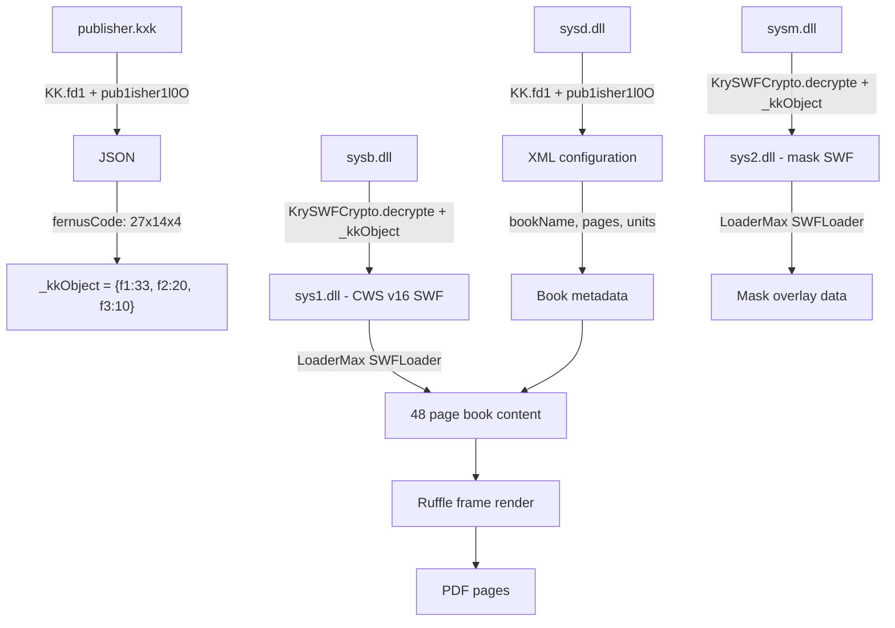

# v1 Wine-Free Pipeline — Full Analysis & Code Reference

**Date:** 2026-08-02  
**Book Name:** Isler 4065 (4065.exe)

---

## 1. Summary
- **4065.exe:** UPX-packed PE32, 50MB packed / 65MB unpacked
- PE header → 9 sections (.text, CODE, .rdata, .data, .rsrc …)
- 40MB trailer → **Authenticode signature** (Not the actual pages!)
- Inside there was a UI/loader SWF but these are **not book pages**

### 1.1 Where are the actual files

Temp file.

| File | Encryption | Result |
|---|---|---|
| `sysb.dll` (1.6MB) | KrySWFCrypto byte scramble | CWS v16 SWF → **48 pages** |
| `sysm.dll` (1.7MB) | KrySWFCrypto byte scramble | CWS SWF (mask overlay) |
| `sysd.dll` (70KB) | KK::fd1 double-B64+Blowfish | `<data>` XML (UI Configuration) |
| `publisher.kxk` | KK::fd1 | JSON config |

### 1.3 Wine Pipeline
```
EXE → Execute via wine → watch %APPDATA%/Roaming → capture sys1.dll/sys2.dll
→ patch_swf → Ruffle frame capture → JPEG → PDF
```
- `sys1.dll` / `sys2.dll` → Temp files provided by fernus, in the newer encryption, removed

```
Find sysb.dll → KrySWFCrypto::decrypt → CWS→FWS decompress
→ patch_swf → Ruffle frame capture → JPEG → PDF
```
- `DEFAULT_KRY_CODE = { f1: 33, f2: 20, f3: 10 }` → `sysb.dll`

---

## 2. Cryptography

### 2.1 KK::fd1 — String Decryption

```text
Input: Base64 string + key (e.g. "pub1isher1l0O")
  → fd2 (reverse → b64decode → XOR)
  → lenient b64decode (only [A-Za-z0-9+/=] characters)
  → Blowfish-ECB (key = keyStr's UTF-8 bytes)
  → PKCS5 unpad
```

**CRITICAL:** AS3 `Base64Decoder.decode` silently skips invalid characters.  
NULL bytes produced after XOR must be filtered out.

### 2.2 KrySWFCrypto — Byte Scramble

```text
separateBytes(b, 10000, 11000, f1, f2)
separateBytes(b, 5000,  5500,  f3, f1)
separateBytes(b,  850,  1500,  f2, f3)
separateBytes(b,    0,   300,  f1, f2)
b[f3]-=f3; b[f2]-=f2; b[f1]-=f1
b[2]-=f3;   b[1]-=f2;   b[0]-=f1
```

`separateBytes(b, sIdx, eIdx, n1, n2)`:
```text
range = [sIdx, eIdx + n1*3)
temp = [(b[i] - n2) & 0xFF]
temp.reverse()
b[i] = (temp[i] - n2) & 0xFF
```
All arithmetic is **wrapping_sub** (mod 256).

### 2.3 KryCode = { f1, f2, f3 }

```text
fernusCode = "27x14x4"  (or "27_14_4")
pkxkname   = "fernus"   (len = 6)
→ f1 = 27+6 = 33
→ f2 = 14+6 = 20
→ f3 = 4+6  = 10
```

This value has been verified for `sysb.dll` (via crib attack: `CWS\x10` header).

---

## 3. Fernus Runtime Source Code Inside SWF (Decompiled AS3)

> **Note:** This section is taken from JPEXS decompile outputs under `isler-4065/analysis/`. This code belongs to Fernus's own Flash/AIR runtime — it's embedded inside `z-kitap-kxk.swf` and distributed with the EXE. It contains the critical classes that decrypt book pages.

### 3.1 com.kxk.KK — String Decryption (Blowfish-ECB)

Fernus's main encryption class. Decrypts text-based files like `publisher.kxk` and `sysd.dll`.

```actionscript
package com.kxk
{
   import com.hurlant.crypto.Crypto;
   import com.hurlant.crypto.symmetric.ICipher;
   import com.hurlant.util.Base64;
   import com.hurlant.util.Hex;
   import flash.utils.ByteArray;
   import mx.utils.Base64Decoder;
   
   public class KK
   {
      public function KK()
      {
         super();
      }
      
      public function fd1(data:String, keyStr:String, _s:Boolean = true) : String
      {
         var key:ByteArray = null;
         var dec:Base64Decoder = new Base64Decoder();
         if(_s)
         {
            data = this.fd2(data,keyStr);
         }
         dec.decode(data);
         var fileBytes:ByteArray = dec.toByteArray();
         key = Hex.toArray(Hex.fromString(keyStr));
         var aes:ICipher = Crypto.getCipher("blowfish-ecb",key,Crypto.getPad("pkcs5"));
         aes.decrypt(fileBytes);
         return fileBytes.toString();
      }
      
      private function applyXor(inputBuffer:ByteArray, key:String) : ByteArray
      {
         var inChar:int = 0;
         var outChar:* = 0;
         var bitMask:int = 0;
         var outBuffer:ByteArray = new ByteArray();
         var keysBuffer:ByteArray = new ByteArray();
         keysBuffer.writeUTFBytes(key);
         var offset:int = 0;
         while(inputBuffer.bytesAvailable)
         {
            offset = inputBuffer.position % keysBuffer.length;
            inChar = int(inputBuffer.readUnsignedByte());
            bitMask = int(keysBuffer[offset]);
            outChar = bitMask ^ inChar;
            outBuffer.writeByte(outChar);
         }
         return outBuffer;
      }
      
      private function fd2(input:String, key:String) : String
      {
         var inputBuffer:ByteArray = Base64.decodeToByteArray(input.split("").reverse().join(""));
         var out:ByteArray = this.applyXor(inputBuffer,key);
         out.position = 0;
         return out.readUTFBytes(out.length);
      }
   }
}
```

**Algorithm summary (`fd1`):**
1. `fd2`: Reverse input → Base64 decode → XOR (with key) → return UTF-8 string
2. Lenient Base64 decode (AS3 `Base64Decoder.decode` silently skips invalid characters)
3. Convert key via `Hex.fromString(keyStr)` → `Hex.toArray(...)` to byte array (UTF-8 bytes of key → hex string → back to bytes — result: key's UTF-8 bytes)
4. **Blowfish-ECB** decrypt (PKCS5 padding)
5. ByteArray → UTF-8 string

### 3.2 com.kxk.KrySWFCrypto — SWF Byte Scramble

Decrypts `sysb.dll` and `sysm.dll` files that contain book pages. **Without this class, page SWFs cannot be opened.**

```actionscript
package com.kxk
{
   import flash.display.MovieClip;
   import flash.utils.ByteArray;
   
   public class KrySWFCrypto extends MovieClip
   {
      public var onComplete:Function;
      
      private var _bytes:ByteArray;
      private var _code:Object;
      
      public function KrySWFCrypto()
      {
         super();
      }
      
      public function decrypte(_fBytes:ByteArray, _fCode:Object) : ByteArray
      {
         this._bytes = _fBytes;
         this._code = _fCode;
         this.separateBytes(this._bytes,10000,11000,this._code.f1,this._code.f2);
         this.separateBytes(this._bytes,5000,5500,this._code.f3,this._code.f1);
         this.separateBytes(this._bytes,850,1500,this._code.f2,this._code.f3);
         this.separateBytes(this._bytes,0,300,this._code.f1,this._code.f2);
         this._bytes[this._code.f3] -= this._code.f3;
         this._bytes[this._code.f2] -= this._code.f2;
         this._bytes[this._code.f1] -= this._code.f1;
         this._bytes[2] -= this._code.f3;
         this._bytes[1] -= this._code.f2;
         this._bytes[0] -= this._code.f1;
         return this._bytes;
      }
      
      private function separateBytes(_b:ByteArray, _sIndex:int, _eIndex:int, _n1:int, _n2:int) : *
      {
         var _i:* = undefined;
         var _tempArray:Array = new Array();
         for(_i = _sIndex; _i < _eIndex + _n1 * 3; _i++)
         {
            _tempArray.push(_b[_i] - _n2);
         }
         _tempArray.reverse();
         var _k:* = 0;
         for(_i = _sIndex; _i < _eIndex + _n1 * 3; _i++)
         {
            _b[_i] = _tempArray[_k] - _n2;
            _k++;
         }
      }
   }
}
```

**Algorithm summary (`decrypte`):**
1. 4x `separateBytes` calls (each reverses a specific range and subtracts `n2`)
2. 6x fixed-position `-=` corrections (f1, f2, f3 positions + 0, 1, 2)

### 3.3 MainTimeline — publisher.kxk Processing and _kkObject Derivation

This code shows how `publisher.kxk` is loaded and `_kkObject` is constructed. The `_kkObject.f1/f2/f3` values serve as the key for `KrySWFCrypto`.

```actionscript
// MainTimeline.as - after publisher.kxk load (~line 14885-14900)
var _kk:KK = new KK();
var _j:* = JSON.parse(_kk.fd1(String(e.currentTarget.loader.content.byte),"pub1isher1l0O"));
this._pkxkname = String(_j.pkxkname);
this._publisher = String(_j.publisher);
var _f:* = _kk.fd1(String(_j.fernusCode),"pub1isher1l0O");
this._kkObject.f1 = int(_f.split("x")[0]) + this._pkxkname.length;
this._kkObject.f2 = int(_f.split("x")[1]) + this._pkxkname.length;
this._kkObject.f3 = int(_f.split("x")[2]) + this._pkxkname.length;
this._passwordStatus = Boolean(_j.passwordStatus);
```

**Critical:** The `fernusCode` string is in `"XxYxZ"` format (e.g. `"27x14x4"`). The f1/f2/f3 components of `_kkObject` are computed by adding `_pkxkname.length` to these values.

**Verified example:** `fernusCode = "27x14x4"`, `pkxkname = "fernus"` (len=6) → `{f1: 33, f2: 20, f3: 10}`. This value has been verified for `sysb.dll` via crib attack.

### 3.4 MainTimeline — Default Values (When publisher.kxk is Missing)

If `publisher.kxk` is not found, the runtime uses these hardcoded values:

```actionscript
// MainTimeline.as - constructor/init section (~line 15320-15340)
this._appLanguage = "tr";
this._pkxkname = "fernus";
this._publisher = "FERNUS";
this._fernusCode = "29_10_31";
this._passwordStatus = true;
this._cloudBase = "http://derstekrari.com/api/action.php";
this._fernusLink = "http://www.fernusconnect.com/checker.php";
this._soKXKKey = this._pkxkname + "key.sys";
this._soKXKBlackKey = this._pkxkname + "book.sys";
this._mainFolderPath = new File(File.applicationDirectory.nativePath).url + "/";
this._tempPath = new File(this._mainFolderPath + "files").url + "/";
this._mainFilename = new File(File.applicationDirectory.nativePath).url + "z-kitap-kxk.swf";
this._capYOffset = 35;
this._kkObject = new Object();
this._appType = "lite";
this._proMode = true;
```

> **Important:** Default `_fernusCode = "29_10_31"` (`_` delimited format) and `_pkxkname = "fernus"` (len=6). In this case `_kkObject` remains an empty `Object` — without `publisher.kxk` the book cannot decrypt `sysb.dll`, and a key entry screen is shown.

### 3.5 MainTimeline — sysd.dll Decryption and XML Parsing (xmlComplete)

```actionscript
// MainTimeline.as - loadData() and xmlComplete() (~line 1600-1720)
public function loadData() : *
{
   this.pnlKey.con.bExit.removeEventListener(MouseEvent.CLICK,this.exitApp);
   this.removeStage(this.pnlKey);
   this.openLoading();
   if(!new File(this._tempPath + "sysd.dll").exists)
   {
      this.warning("Some files are missing. Try downloading the book again.");
      return;
   }
   this._urlLoader.addEventListener(Event.COMPLETE,this.xmlComplete);
   this._urlLoader.load(new URLRequest(new File(this._tempPath + "sysd.dll").url));
}

public function xmlComplete(e:Event) : void
{
   var _kk:* = new KK();
   var _w:* = _kk.fd1(e.target.data,"pub1isher1l0O");
   this._xml = new XML(_w);
   this._urlLoader.removeEventListener(Event.COMPLETE,this.xmlComplete);
   this._bookName = this._xml.settings.bookName;
   // Build the page list
   for each(page in this._xml.pages.page)
   {
      this._pages[this._int] = new Array();
      this._pages[this._int]["no"] = page.pageNum;
      this._pages[this._int]["content"] = page.pageCon;
      ++this._int;
   }
   // ... (units, selection areas, masks, games, actions, etc. are parsed) ...
   this._jump = int(this._xml.settings.jump);
   // ... 
   this.dataFunction(this._bookdataName,this.loadMask,"sys1.dll");
}
```

**Flow:** `sysd.dll` file is read via `URLLoader` → decrypted with `KK.fd1(data, "pub1isher1l0O")` → XML parsed → book structure (page list, units, interactive elements) loaded into memory → proceeds to `sysb.dll` decryption via `dataFunction`.

### 3.6 MainTimeline — sysb.dll Decryption and sys1.dll Write (dataFunction)

**The most critical method.** `sysb.dll` → `KrySWFCrypto.decrypte` → `sys1.dll` (decrypted book SWF).

```actionscript
// MainTimeline.as - dataFunction() (~line 2060-2085)
public function dataFunction(_p:String, _f:Function, _fN:String) : void
{
   var _swfLoader:* = undefined;
   if(!new File(this._tempPath + _p).exists)
   {
      this.warning("Some files are missing. Try downloading the book again.");
      return;
   }
   try
   {
      _swfLoader = new BinaryDataLoader(new File(this._tempPath + _p).url,{
         "name":"swf",
         "autoPlay":false,
         "onComplete":function(e:LoaderEvent):*
         {
            var _kry:* = new KrySWFCrypto();
            _fileManager = new FileManager();
            _fileManager.addEventListener(Event.COMPLETE,_f);
            _fileManager.writeFile(
               File.applicationStorageDirectory.resolvePath(_fN).url,
               _kry.decrypte(_swfLoader.content,_kkObject)
            );
            _swfLoader.dispose(true);
            _swfLoader = null;
         }
      });
      _swfLoader.load(true);
   }
   catch(e:*)
   {
   }
}
```

**Flow:**
1. `sysb.dll` (or `sysm.dll`) is loaded as binary via `BinaryDataLoader`
2. Decrypted with `KrySWFCrypto.decrypte(content, _kkObject)`
3. Written to `File.applicationStorageDirectory` as `sys1.dll` (or `sys2.dll`) via `FileManager.writeFile`
4. Callback (`_f` = `loadMask`) fires, `sys1.dll` is loaded as SWF via `LoaderMax`

### 3.7 MainTimeline — Loading the Book SWF (maskSwfWriteComplete)

```actionscript
// MainTimeline.as - maskSwfWriteComplete() (~line 2090-2110)
public function maskSwfWriteComplete(e:Event = null) : *
{
   var _lc:LoaderContext = new LoaderContext(true,new ApplicationDomain(),SecurityDomain.currentDomain);
   this._queue = new LoaderMax({
      "name":"mainQueue",
      "context":_lc,
      "onComplete":this.bookLoadingCompleted
   });
   this._queue.append(new SWFLoader(File.applicationStorageDirectory.resolvePath("sys1.dll").url,{
      "name":"bookdata",
      "autoPlay":false
   }));
   if(this._maskChecker)
   {
      this._queue.append(new SWFLoader(File.applicationStorageDirectory.resolvePath("sys2.dll").url,{
         "name":"maskdata",
         "autoPlay":false
      }));
   }
   this._queue.load(true);
}
```

**Flow:** Decrypted `sys1.dll` (and optional `sys2.dll`) is loaded as SWF via `LoaderMax` → `rawContent` is retrieved in `bookLoadingCompleted` callback → book pages are displayed via `gotoAndStop`.

### 3.8 com.kxk.FileManager — File Operations (summary)

```actionscript
package com.kxk
{
   import flash.desktop.NativeProcess;
   import flash.desktop.NativeProcessStartupInfo;
   import flash.events.Event;
   import flash.events.EventDispatcher;
   import flash.events.IOErrorEvent;
   import flash.filesystem.File;
   import flash.filesystem.FileMode;
   import flash.filesystem.FileStream;
   import flash.utils.ByteArray;
   
   public class FileManager extends EventDispatcher
   {
      public static function moveFileAsync(_path1:String, _path2:String, 
         _complete:Function = null, _error:Function = null) : void { /* ... */ }
      
      public static function deleteFileAsync(_path:String, _func:Function) : void { /* ... */ }
      
      public static function deleteFile(_path:String) : void
      {
         var _f:* = new File(_path);
         if(_f.exists) { _f.deleteFile(); }
      }
      
      public static function exists(_path:String) : Boolean
      {
         return new File(_path).exists;
      }
      
      public function writeFile(_path:String, _bytes:ByteArray) : void
      {
         // Writes byte array to disk via FileStream
         // Dispatches Event.COMPLETE when done
      }
      
      public function writeUTFFile(_path:String, _data:String) : void { /* ... */ }
      
      public function unzipFileSFX(_zipPath:String, _outputPath:String) : void { /* ... */ }
   }
}
```

The `writeFile` method is used inside `dataFunction` to write decrypted SWF bytes to disk as `sys1.dll` / `sys2.dll`.

### 3.9 Key Validation (ck method)

```actionscript
// MainTimeline.as - ck() license key validation
public function ck(myKey:String) : *
{
   var totKey:int = 0;
   var charsArray:Array = "ABCDEFGHJKLMNPRSTVYZ123456789".split("");
   var kArr:Array = myKey.toUpperCase().split("");
   if(myKey.split("").length >= 8)
   {
      totKey = myKey.charCodeAt(0) + myKey.charCodeAt(3) + myKey.charCodeAt(4) 
             + myKey.charCodeAt(5) + myKey.charCodeAt(7);
      if(charsArray[totKey % (int(this._kkObject.f1) - this._pkxkname.length)] == kArr[1] 
         && charsArray[totKey % (int(this._kkObject.f2) - this._pkxkname.length)] == kArr[2] 
         && charsArray[totKey % (int(this._kkObject.f3) - this._pkxkname.length)] == kArr[6])
      {
         return true;
      }
      return false;
   }
   return false;
}
```

**Note:** Key validation subtracts `_pkxkname.length` from `_kkObject.f1/f2/f3` to recover the original `fernusCode` components and uses them in the modulus operation. This is an additional verification point for reverse-engineering `fernusCode`.

### 3.10 Overall Encryption Flow Diagram



---

## 4. Known Issues and Solutions

### 4.1 Old Pipeline → sys1.dll (Wine)
The old code monitored `sys1.dll` / `sys2.dll` files under `%APPDATA%/Roaming`. These were temporary SWFs **already decrypted** by the Fernus runtime. The new pipeline decrypts these files directly from `sysb.dll` cryptographically.

