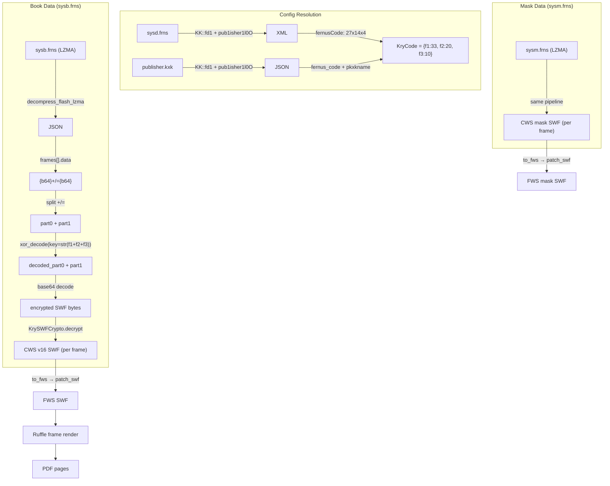

# v2 FRNS Pipeline — Full Analysis & Code Reference

**Date:** 2026-08-03  
**Book Name:** Çap 2023-11 Sınıf Matematik AL Fasikül 1

---

## 1. Summary

### 1.1 What Changed Between v1 and v2

Circa 2023+, Fernus switched from `.dll` to `.frns` files:

| Aspect | v1 (.dll) | v2 (.frns) |
|---|---|---|
| **Container** | Raw bytes dropped to `%TEMP%` | Flash LZMA-compressed JSON |
| **Book data** | `sysb.dll` → one multi-frame SWF | `sysb.frns` → per-frame encrypted SWFs |
| **Mask data** | `sysm.dll` → one multi-frame SWF | `sysm.frns` → per-frame encrypted SWFs |
| **Config** | `sysd.dll` → KK::fd1 encrypted XML | `sysd.frns` → KK::fd1 encrypted XML (same!) |
| **Temp files** | Runtime drops `sys1.dll`/`sys2.dll` (decrypted) | Runtime no longer drops decrypted SWFs |
| **Encryption** | KrySWFCrypto scramble on whole file | Per-frame: XOR-decode + base64 + KrySWFCrypto |
| **KryCode** | Same `{f1, f2, f3}` derivation | Same derivation, same default `{33, 20, 10}` |

### 1.2 Where are the actual files

Temp file (extracted by Wine → `%TEMP%` watcher).

| File | Encryption | Result |
|---|---|---|
| `sysb.frns` (9.6MB) | LZMA → JSON → per-frame XOR+B64+KrySWFCrypto | Per-frame CWS SWF → **112 pages** |
| `sysm.frns` (10.9MB) | LZMA → JSON → per-frame XOR+B64+KrySWFCrypto | Per-frame CWS SWF (mask overlay) |
| `sysd.frns` (635KB) | KK::fd1 | `<data>` XML (UI Configuration) |
| `publisher.kxk` | KK::fd1 | JSON config |

### 1.3 Pipeline Flow

```
EXE → Execute via wine → watch %TEMP% → capture *.frns / *.kxk / *.zip
→ Detect format (.frns extension)
→ Decompress Flash LZMA (13-byte header + raw LZMA1)
→ Parse JSON: {totalFrames, frames: [{frame, width, height, data}]}
→ Per frame: split("+/=") → XOR-decode part0 → concat → base64 → KrySWFCrypto
→ CWS→FWS decompress → patch_swf → Ruffle frame capture → JPEG → PDF
```

---

## 2. File Format Details

### 2.1 Flash LZMA Compression

Both `sysb.frns` and `sysm.frns` are Flash LZMA-compressed. This is **not** standard `.7z` or `.xz` — it's a raw LZMA1 stream with a 13-byte Flash-specific header:

```text
Offset  Size  Description
------  ----  -----------
0       1     Properties byte: (pb * 5 + lp) * 9 + lc
1       4     Dictionary size (u32 LE)
5       8     Uncompressed size (u64 LE)
13      N     Raw LZMA1 stream
```

**Properties decoding:**
```
props = data[0]
lc = props % 9
lp = (props / 9) % 5
pb = (props / 9) / 5
```

Valid ranges: `lc ≤ 8`, `lp ≤ 4`, `pb ≤ 4`. This provides a reliable heuristic for detecting LZMA vs plaintext.

**Detection (Rust):**
```rust
pub fn is_lzma_compressed(data: &[u8]) -> bool {
    if data.len() < 13 { return false; }
    let props = data[0];
    let lc = props % 9;
    let remaining = props / 9;
    let lp = remaining % 5;
    let pb = remaining / 5;
    lc <= 8 && lp <= 4 && pb <= 4
}
```

### 2.2 FRNS JSON Structure

After LZMA decompression, the result is a UTF-8 JSON string:

```json
{
  "totalFrames": 112,
  "frames": [
    {
      "frame": 1,
      "width": 595.0,
      "height": 842.0,
      "data": "ASNFZ4mrze8BA...+/=...morebase64..."
    },
    ...
  ]
}
```

**Rust structs (`src/fernus/frns.rs`):**
```rust
#[derive(Debug, Clone, Deserialize)]
pub struct FrnsBook {
    #[serde(rename = "totalFrames")]
    pub total_frames: u32,
    pub frames: Vec<FrnsFrame>,
}

#[derive(Debug, Clone, Deserialize)]
pub struct FrnsFrame {
    pub frame: u32,
    pub width: f64,
    pub height: f64,
    pub data: String,
}
```

### 2.3 Frame Data Format

Each frame's `data` field has the form:

```text
{b64_part0}+/={b64_part1}
```

The `+/=` separator splits the data into two base64-encoded parts:
- **part0**: XOR-encoded with key = `str(f1 + f2 + f3)` (e.g. `"63"`)
- **part1**: Raw base64 payload (appended after part0 is decoded)

---

## 3. Cryptography

### 3.1 Per-Frame Decryption Pipeline

This mirrors the Actionscript `BookClip.gotoAndStop`:

```actionscript
var str = this.data.frames[...].data;
str = this.decode(str.split("+/=")[0], f1+f2+f3) + str.split("+/=")[1];
var byte = Base64.decodeToByteArray(str);
byte = kry.decrypte(byte, kkObject);
```

**Step-by-step (Rust implementation in `FrnsFrame::decrypt`):**

```
1. split(data, "+/=") → (part0_b64, part1_b64)

2. xor_decode_b64(part0_b64, key=str(f1+f2+f3)):
   a. base64 decode part0_b64 → bytes
   b. XOR each byte with repeating key
   c. bytes → UTF-8 string (this is the decoded part0)

3. combined = decoded_part0 + part1_b64

4. Filter combined to valid base64 alphabet [A-Za-z0-9+/=]
   (AS3 Base64Decoder silently skips invalid chars)

5. base64 decode filtered → encrypted SWF bytes

6. KrySWFCrypto::decrypt(bytes, {f1, f2, f3})
   → CWS SWF bytes
```

### 3.2 XOR Decode (BookClip.decode mirror)

```actionscript
var inputBuffer = Base64.decodeToByteArray(input);
var out = applyXor(inputBuffer, key);
out.position = 0;
return out.readUTFBytes(out.length);
```

**Rust:**
```rust
fn xor_decode_b64(b64: &str, key: &str) -> Result<String> {
    let bytes = base64::engine::general_purpose::STANDARD.decode(b64)?;
    let key_bytes = key.as_bytes();
    let xored: Vec<u8> = bytes
        .iter()
        .enumerate()
        .map(|(i, &b)| b ^ key_bytes[i % key_bytes.len()])
        .collect();
    String::from_utf8(xored)
}
```

### 3.3 KrySWFCrypto (Same as v1)

The final step uses the **identical** `KrySWFCrypto::decrypt` as v1:

```rust
pub fn decrypt(bytes: &mut [u8], code: &KryCode) -> Result<()> {
    separate_bytes(bytes, 10000, 11000, code.f1, code.f2);
    separate_bytes(bytes, 5000, 5500, code.f3, code.f1);
    separate_bytes(bytes, 850, 1500, code.f2, code.f3);
    separate_bytes(bytes, 0, 300, code.f1, code.f2);
    // 6 fixed-position wrapping_sub corrections
    bytes[f3] -= f3; bytes[f2] -= f2; bytes[f1] -= f1;
    bytes[2]  -= f3; bytes[1]  -= f2; bytes[0]  -= f1;
}
```

See `v1.md` §2.2 and §3.2 for the full `separateBytes` algorithm.

### 3.4 KryCode Resolution (Unified v1+v2)

The pipeline probes all known config sources in order:

```
1. sysd.frns → KK::fd1 → try JSON → try XML → extract fernusCode + pkxkname
2. sysd.dll  → KK::fd1 → try JSON → try XML → extract fernusCode + pkxkname
3. publisher.kxk → KK::fd1 → JSON → PublisherConfig.kry_code()
4. Fallback: DEFAULT_KRY_CODE = {f1: 33, f2: 20, f3: 10}
```

**Code derivation:**
```rust
// fernusCode = "27x14x4" (or "27_14_4")
// pkxkname = "fernus" (len = 6)
f1 = 27 + 6 = 33
f2 = 14 + 6 = 20
f3 = 4 + 6  = 10
```

### 3.5 sysd.frns (Same as v1 sysd.dll)

`sysd.frns` uses the **same** `KK::fd1` encryption as v1's `sysd.dll`:

```
sysd.frns → base64 text
→ KK::fd1(data, "pub1isher1l0O")
→ Blowfish-ECB decrypt
→ XML: <data><settings><bookName>...</bookName>...
       <fernusCode>27x14x4</fernusCode>
       <pkxkname>fernus</pkxkname>...</settings>
       <pages><page><pageNum>1</pageNum>...
```

See `v1.md` §2.1 and §3.1 for the full `KK::fd1` algorithm.

---

## 4. Rust Implementation Reference

### 4.1 Module Structure

```
src/fernus/
├── mod.rs        → Module declarations
├── crypto.rs     → KK::fd1, KrySWFCrypto, KryCode (shared v1+v2)
├── frns.rs       → V2: LZMA, JSON parsing, per-frame decryption
└── assets.rs     → PublisherConfig, AssetBundle (config discovery)

src/ruffle/
├── mod.rs
├── swf.rs        → to_fws, load, decompress_swf_quick, patch
├── render.rs     → Ruffle renderer (SWF → JPEG frames)
└── exporter.rs   → JPEG → PDF assembly

src/pipeline.rs   → Unified handle_exe() — auto-detects v1 vs v2
```

### 4.2 frns.rs — Core V2 Module

**Key functions:**

| Function | Purpose |
|---|---|
| `is_lzma_compressed(data)` | Heuristic: check if data has valid Flash LZMA header |
| `decompress_flash_lzma(data)` | Decompress 13-byte header + raw LZMA1 → bytes |
| `FrnsFrame::decrypt(code)` | Full per-frame decryption: split → XOR → b64 → KrySWFCrypto |
| `xor_decode_b64(b64, key)` | Mirror of AS3 `BookClip.decode` |
| `load_and_decrypt_book(data, code)` | Full pipeline: LZMA → JSON parse → decrypt all frames |

**Output:**
```rust
pub struct DecryptedFrame {
    pub frame: u32,      // 1-based frame number
    pub width: f64,      // from JSON metadata
    pub height: f64,     // from JSON metadata
    pub swf_bytes: Vec<u8>,  // CWS SWF, ready for to_fws()
}
```

### 4.3 pipeline.rs — Unified Handler

```rust
pub fn handle_exe(exporter, file, scale) -> Result<()> {
    // 1. Launch EXE, watch %TEMP%
    // 2. Collect payloads (*.frns, *.dll, *.kxk, *.zip)
    // 3. Resolve KryCode (sysd.frns → sysd.dll → publisher.kxk → default)
    // 4. For each payload:
    //    - .frns → load_and_decrypt_book() → per-frame write_patched_swf()
    //    - .dll  → try_decrypt_kry() | try_decrypt_fd1() → write_patched_swf()
    // 5. Sort: sysb first, then sysm
    // 6. Render all SWFs → PDF
}
```

### 4.4 swf.rs — SWF Utilities

| Function | Purpose |
|---|---|
| `to_fws(data)` | CWS→FWS (zlib inflate), FWS pass-through, ZWS rejected |
| `load(data)` | Decompress + scan DefineShape bounds for real dims |
| `decompress_swf_quick(data)` | Fast decompress without shape scanning (for FRNS with known dims) |
| `patch(buf, w, h)` | Fix stage rectangle + add frame labels |

---

## 5. Encryption Flow Diagram



---

## 6. Key Differences from v1

### 6.1 What's New
- **LZMA decompression** (`lzma-rs` crate with `raw_decoder` feature)
- **Per-frame encryption**: Each frame independently encrypted, not one multi-frame SWF
- **XOR pre-step**: `BookClip.decode` XOR layer before base64+KrySWFCrypto
- **Frame metadata**: Width/height embedded in JSON (no need to scan DefineShape)
- **No sys1.dll/sys2.dll**: Runtime no longer drops decrypted temp files — we must decrypt ourselves
- **Watcher extension**: `.frns`, `.kxk`, `.zip` added to file watcher

### 6.2 What's the Same
- `KrySWFCrypto` byte scramble algorithm — identical
- `KK::fd1` Blowfish-ECB decryption — identical
- `KryCode` derivation (`fernusCode` + `pkxkname.length`) — identical
- Default `KryCode = {33, 20, 10}` — verified working for both v1 and v2
- `sysd.*` format — XML config via KK::fd1, same structure
- SWF format — CWS v16, same `to_fws` + `patch` pipeline

---

## 7. Build Dependencies

```toml
# Cargo.toml additions for v2 support
lzma-rs = { version = "0.3.0", features = ["raw_decoder"] }
```

Existing dependencies used by both v1 and v2:
- `blowfish 0.10.0` + `cipher 0.5.2` — KK::fd1 Blowfish-ECB
- `base64 0.23.0` — Base64 decode
- `flate2 1.0.35` — CWS→FWS zlib inflate
- `swf` / `ruffle_core` / `ruffle_render_wgpu` — SWF parsing and rendering

---

## 8. Verified Test Results

| File | Operation | Result |
|---|---|---|
| `sysb.frns` | LZMA decompress | 112-frame JSON parsed ✅ |
| `sysb.frns` frame 0 | XOR+B64+KrySWFCrypto with {33,20,10} | Valid CWS SWF (164KB) ✅ |
| `sysm.frns` frame 0 | Same pipeline | Valid CWS mask SWF ✅ |
| `sysd.frns` | KK::fd1("pub1isher1l0O") | XML with `fernusCode="27x14x4"` ✅ |

---

## 9. Known Issues

### 9.1 LZMA Decompression Failure
If `decompress_flash_lzma` fails with "LZMA decoder init" or "LZMA decompress", check:
- The file actually has a 13-byte Flash LZMA header (use `is_lzma_compressed` heuristic)
- `lzma-rs` feature `raw_decoder` is enabled in `Cargo.toml`

### 9.2 Frame Decryption Failure
If `FrnsFrame::decrypt` returns an error:
- **Missing `+/=` separator**: The frame data might not follow the expected `{b64}+/={b64}` format
- **Base64 decode failure**: The combined string may contain non-Base64 characters (the lenient filter should handle this)
- **KrySWFCrypto failure**: Wrong `KryCode` — try resolving from `sysd.frns` or use `DEFAULT_KRY_CODE`

### 9.3 Missing Frames
Some books may have fewer frames than `totalFrames` declares. The pipeline handles this gracefully by continuing on per-frame errors.

### 9.4 p.dll (Skipped)
`p.dll` decryption is explicitly skipped in the current pipeline. If needed, it can be added as an additional config source for `KryCode` resolution.
